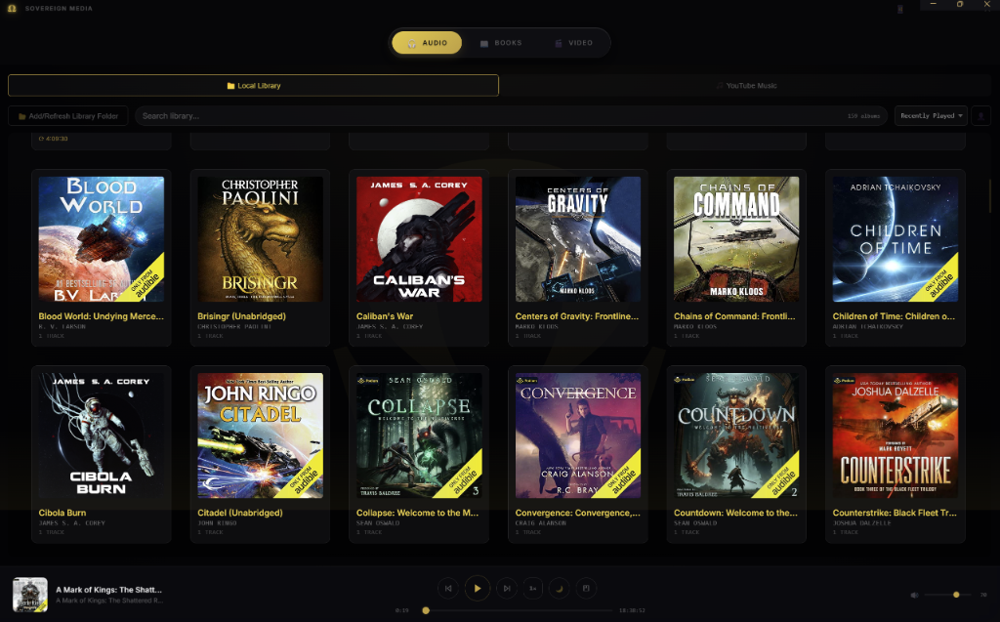
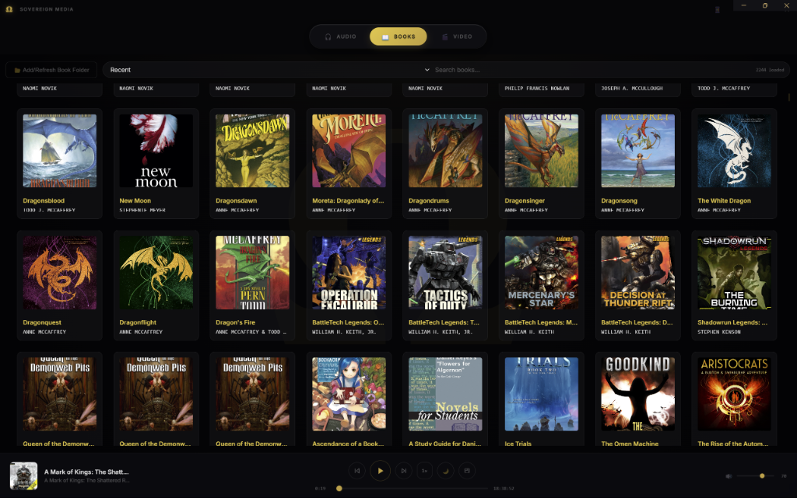
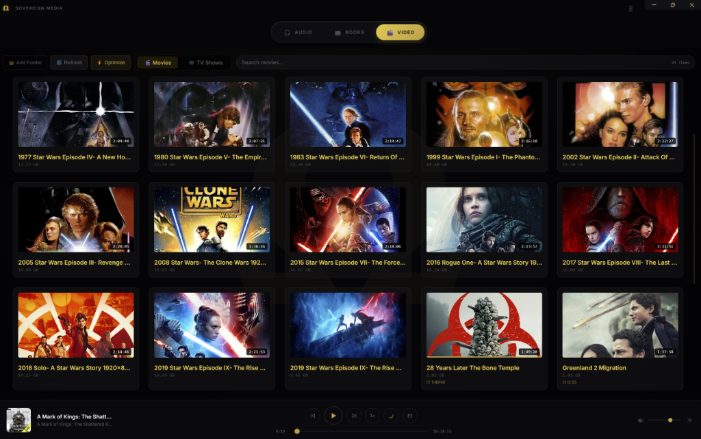

# Sovereign Media

**Operator-grade all-in-one desktop media platform for the VERITAS & Sovereign Ecosystem.**

   

<br/>

<div align="center">
  
  <br/>
  <sup><em>Sovereign Media Audio Library &mdash; VERITAS gold-and-obsidian aesthetic</em></sup>
  <br/><br/>
  
  <br/>
  <sup><em>Sovereign Media eBook Library &mdash; High-fidelity typography controls</em></sup>
  <br/><br/>
  
  <br/>
  <sup><em>Sovereign Media Video Library &mdash; Zero-dependency native playback</em></sup>
</div>
<br/>

---

## Overview

Sovereign Media delivers a unified audiobook, eBook, and video library in a single Electron shell. Operators point the scanner at local media directories; the application indexes metadata, extracts cover art, and persists playback position across sessions. The interface enforces the Gold & Obsidian VERITAS aesthetic — machined, zero-noise, and built for long operational runs.

## Features

| Feature | Description |
|---|---|
| **Audiobook Player** | Full-featured audio playback with chapter navigation, ID3 metadata, cover art, and position persistence |
| **eBook Reader** | epub.js-powered renderer with paginated and scroll modes, typography controls, and reading progress |
| **Video Player** | HTML5 native video with position memory and thumbnail generation |
| **3-Tab Navigation** | Audio / Books / Video with seamless context switching |
| **Position Persistence** | Session state saved per media item across all types; resume exactly where you left off |
| **Library Management** | Folder-based scanner with automatic metadata extraction and cover art fetching |
| **Ghost Launcher** | Custom executable identity in Task Manager via `launcher.js` |

## Quickstart

### 60-Second Demo Path
1. **Download:** Open the app and navigate to the Audio, Books, or Video tab.
2. **Scan:** Click the "Scan Folder" button and select an existing local folder containing your media.
3. **Play:** Sovereign Media instantly extracts metadata and cover art. Click play to begin seamlessly, with position automatically persisted upon exit.

### Install & Run

```bash
git clone https://github.com/VrtxOmega/SovereignMedia.git
cd SovereignMedia
npm install
npm start
```

`npm start` invokes `node launcher.js`, creating a named ghost executable (`SovereignMedia.exe`) and spawning Electron.

### Build / Package
To produce a compiled Windows distributable:
```bash
npm install --save-dev electron-builder
npm run dist
```

## Data Model

Sovereign Media operates entirely on flat JSON files stored in your local `%APPDATA%\sovereign-media` directory. 
- **Schema Versioning:** The `version` string attached internally handles schema compatibility. 
- **Migration Behavior:** If a major schema update is detected, Sovereign Media automatically rebuilds the index by re-scanning authorized local directories. Playback positions are migrated nondestructively over existing assets.

| Data File | Associated Media Set |
|---|---|
| `omega_audio_library.json` | Audiobook index and playback states |
| `sovereign_book_library.json` | eBook index, bookmarks, reading progress |
| `sovereign_video_library.json` | Video index and playback states |

## Threat Model & Trust Boundaries

> **Trust Boundary Analysis**
> - **Offline-first Paradigm:** Local library operations, media scanning, and playback are entirely offline. Zero analytics, no telemetry, and no mandatory cloud handshakes.
> - **Optional Network Features:** Remote integrations (e.g., the YouTube Music tab or the mobile remote tunnel) are explicitly gated and opt-in.
> - **Security Advisory:** Enabling the mobile bridge integrates `localtunnel`, effectively exposing a local port to a public relay. Operators in high-security environments must explicitly disable the mobile remote or restrict it strictly to LAN-only mode.

## Architecture

```text
+------------------------------------------------------------------+
|                        SOVEREIGN MEDIA                           |
|                      (Electron 30.x Shell)                       |
|                                                                  |
|  +------------------------------------------------------------+  |
|  |                    Renderer Process                        |  |
|  |   +----------+   +----------+   +--------------------+    |  |
|  |   |  Audio   |   |  Books   |   |       Video        |    |  |
|  |   |  HTML5   |   | epub.js  |   |   HTML5 + video.js |    |  |
|  |   +-----+----+   +-----+----+   +----------+---------+    |  |
|  +---------|--------------|--------------------|--------------+  |
|            |   contextBridge / preload.js      |                 |
|  +---------|--------------|--------------------|--------------+  |
|  |         |        Main Process               |              |  |
|  |   +-----v--------------v-------------------v-----------+  |  |
|  |   |              IPC Handlers (main.js)                 |  |  |
|  |   +----------------------+---------------------------------+  |  |
|  |                          |                              |  |  |
|  |   +----------------------v------------------------------+  |  |
|  |   |        Persistent Storage (userData)                |  |  |
|  +-------------------------------------------------------------+  |
+------------------------------------------------------------------+
```

## Ecosystem Canon

Sovereign Media is the primary media consumption node within the Omega Universe — a purpose-built Electron application engineered to consolidate media into a single, sovereign operator environment. Architecturally, Sovereign Media is not a wrapper around a browser media stack — it is a hardened desktop runtime with IPC-isolated renderer processes and a ghost-executable launcher for clean system identity. Within the Omega operator stack, it serves as the canonical media layer, complementing the intelligence infrastructure provided by Aegis, omega-brain-mcp, and Ollama-Omega.

## Roadmap

The core application is currently in sealed/stable operation. Proposed roadmap capabilities:
- Hardened mobile remote with token-based authentication
- Electron auto-updater integration
- Playlist and queue management across media types
- Per-library encryption at rest

## Omega Universe

Sovereign Media is one node in the Omega operator ecosystem. Related repositories:

| Repository | Role |
|---|---|
| [sovereign-arcade](https://github.com/VrtxOmega/sovereign-arcade) | Operator gaming layer |
| [drift](https://github.com/VrtxOmega/drift) | Real-time telemetry and drift monitoring |
| [omega-brain-mcp](https://github.com/VrtxOmega/omega-brain-mcp) | AI inference orchestration (MCP server) |
| [Aegis](https://github.com/VrtxOmega/Aegis) | Security and access control layer |


## 🌐 VERITAS Omega Ecosystem

This project is part of the [VERITAS Omega Universe](https://github.com/VrtxOmega/veritas-portfolio) — a sovereign AI infrastructure stack.

- [VERITAS-Omega-CODE](https://github.com/VrtxOmega/VERITAS-Omega-CODE) — Deterministic verification spec (10-gate pipeline)
- [omega-brain-mcp](https://github.com/VrtxOmega/omega-brain-mcp) — Governance MCP server (Triple-A rated on Glama)
- [Gravity-Omega](https://github.com/VrtxOmega/Gravity-Omega) — Desktop AI operator platform
- [Ollama-Omega](https://github.com/VrtxOmega/Ollama-Omega) — Ollama MCP bridge for any IDE
- [OmegaWallet](https://github.com/VrtxOmega/OmegaWallet) — Desktop Ethereum wallet (renderer-cannot-sign)
- [veritas-vault](https://github.com/VrtxOmega/veritas-vault) — Local-first AI knowledge engine
- [sovereign-arcade](https://github.com/VrtxOmega/sovereign-arcade) — 8-game arcade with VERITAS design system
- [SSWP](https://github.com/VrtxOmega/sswp-mcp) — Deterministic build attestation protocol
## License

MIT — see [LICENSE](./LICENSE) for full terms.

<div align="center">
  <sub>SOVEREIGN MEDIA — VERITAS &amp; Omega Universe | Built by <a href="https://github.com/VrtxOmega">RJ Lopez</a></sub>
</div>
